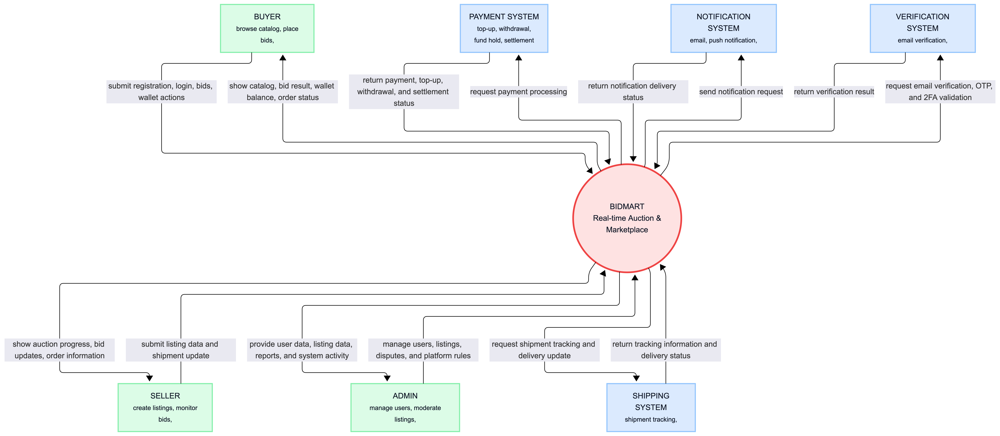
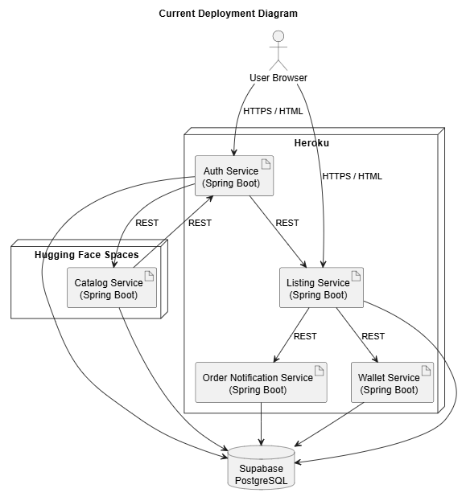
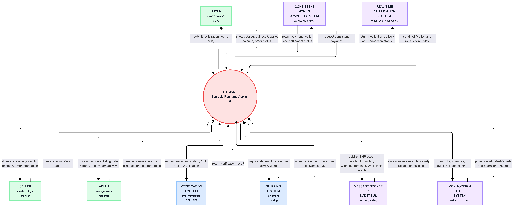
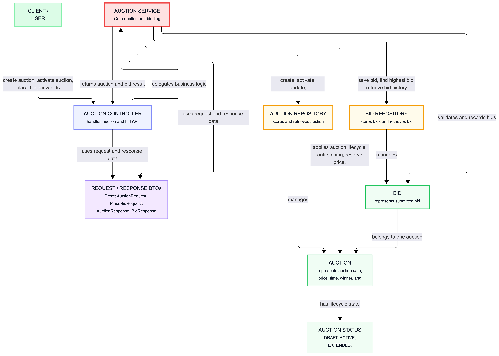
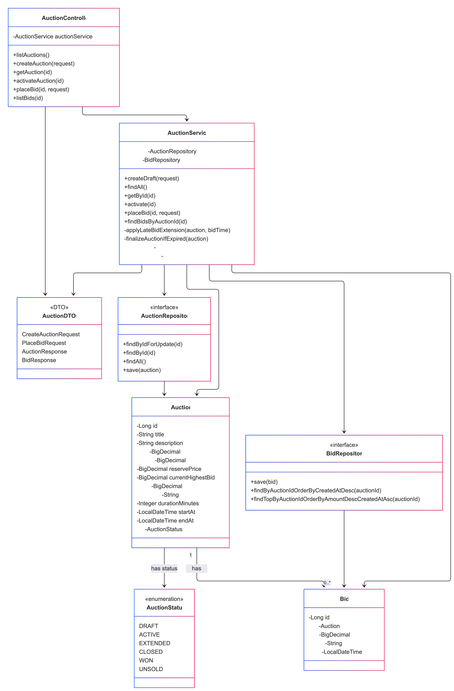
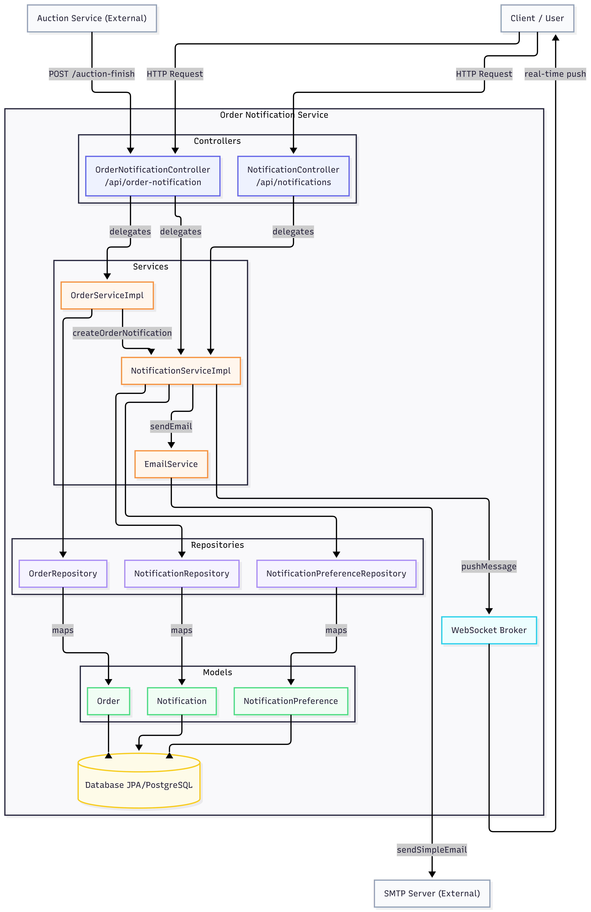
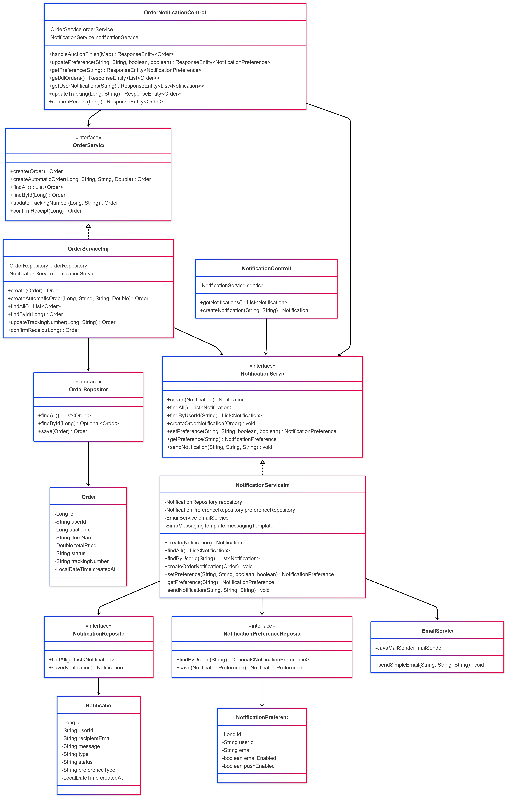
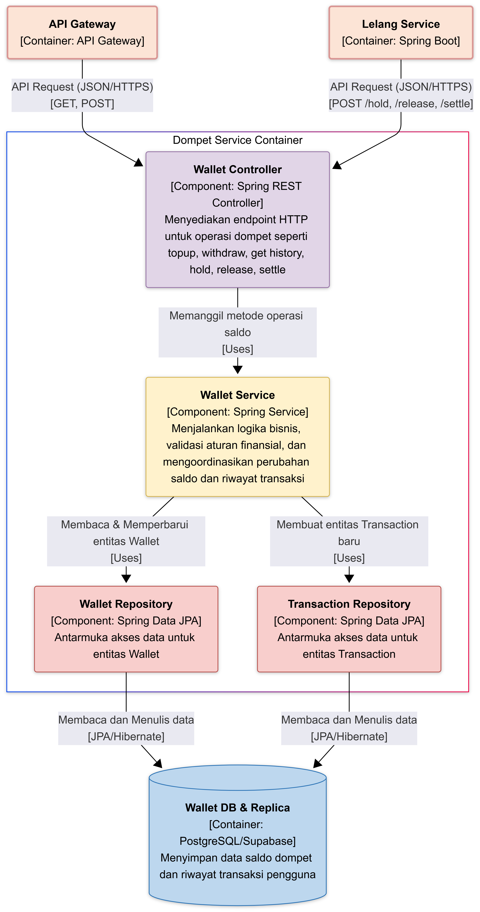
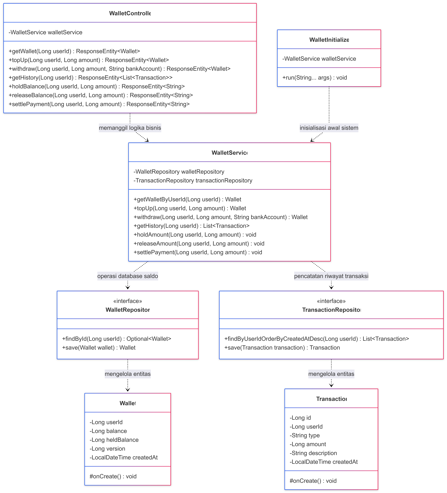

# advprog-module9
**Module 9 Advanced Programming 2025/2026**

**Software Architecture**

**Kelompok A6**
1. Affandi Shafwan Soleh - 2306245075
2. Jovian Felix Rustan - 2406360016
3. Jonathan Yitskhaq Rundjan - 2406435231
4. Aaron Nathanael Suhaendi - 2406437073
5. Farras Syafiq Ulumuddin - 2406495722

## Deliverable G.1
### Container Diagram

### Context Diagram

### Deployment Diagram

## Deliverable G.2

### Future Container

### Future Context

## Deliverable G.3
## Risk Analysis dan Justifikasi Modifikasi Arsitektur BidMart

### Risk Analysis untuk Arsitektur yang Diperbarui

#### a. Risiko Skalabilitas pada Lelang Service

Lelang Service adalah titik paling kritis di BidMart karena menangani seluruh logika penawaran secara real-time. Dalam arsitektur yang diperbarui, service ini dikonfigurasi dengan connection pool maksimum 70 koneksi ke database Auction DB. Ketika ratusan pengguna mengajukan penawaran secara bersamaan pada item populer, connection pool bisa habis sebelum semua request selesai diproses. Request yang tidak kebagian koneksi akan mengantre atau langsung gagal, sehingga pengguna mendapat error di tengah sesi penawaran aktif. Situasi ini menjadi lebih berisiko karena setiap penawaran juga memicu pemanggilan ke Dompet Service untuk menahan saldo artinya satu bid melibatkan minimal dua koneksi database secara hampir bersamaan.

#### b. Risiko Keamanan pada Input Pengguna

Katalog Service menerima input teks bebas dari Seller, seperti judul listing, deskripsi barang, dan nama kategori. Jika input tersebut disimpan tanpa sanitasi dan kemudian ditampilkan kembali ke Buyer melalui Single-Page App, sistem menjadi rentan terhadap serangan Stored XSS. Risiko ini meningkat karena halaman detail listing diakses oleh banyak pengguna secara bersamaan, sehingga satu payload berbahaya yang berhasil tersimpan dapat berdampak luas. Selain itu, API Gateway yang menjadi pintu masuk tunggal perlu memastikan validasi token dilakukan secara konsisten, celah kecil di sini dapat dimanfaatkan untuk mengakses endpoint yang seharusnya terlindungi.

#### c. Risiko Ketergantungan pada Autentikasi Service

Seluruh service Lelang, Katalog, Dompet, dan Pesanan memanggil Autentikasi Service untuk memverifikasi token pengguna sebelum memproses request. Jika Autentikasi Service mengalami latensi tinggi atau downtime sesaat, semua service yang bergantung padanya akan ikut melambat atau gagal merespons. Pada platform lelang real-time, bahkan latensi beberapa ratus milidetik saja dapat menyebabkan pengguna kehilangan kesempatan mengajukan penawaran di detik-detik terakhir lelang. Pola ketergantungan sinkronus seperti ini menciptakan risiko kegagalan berantai yang sulit dimitigasi tanpa mekanisme circuit breaker atau caching token di sisi masing-masing service.

#### d. Risiko Performa API Gateway sebagai Single Point of Entry

API Gateway dalam arsitektur yang diperbarui menjadi satu-satunya jalur masuk untuk semua request dari frontend ke backend. Ketika traffic meningkat tajam, misalnya saat beberapa lelang besar berakhir hampir bersamaan, API Gateway dapat menjadi bottleneck jika kapasitasnya tidak diskalakan sesuai beban. Selain itu, jika konfigurasi routing atau load balancing tidak optimal, beban bisa terdistribusi tidak merata: sebagian instance service kewalahan sementara yang lain masih idle. Kondisi ini kontraproduktif mengingat alasan utama penambahan connection pool per service adalah untuk menangani konkurensi tinggi secara merata.

---

### Justifikasi Modifikasi Arsitektur

Perubahan dari arsitektur saat ini ke arsitektur yang diperbarui didorong oleh kebutuhan untuk mengatasi risiko-risiko di atas secara sistematis. Penambahan **API Gateway** sebagai single point of entry menyederhanakan pengelolaan autentikasi dan routing alih-alih setiap service mengelola logic tersebut sendiri-sendiri, API Gateway mengambil alih pengecekan awal sehingga service di belakangnya dapat fokus pada domain masing-masing. Ini juga memudahkan penerapan rate limiting dan monitoring terpusat, yang sebelumnya tidak mungkin dilakukan secara konsisten di arsitektur tanpa gateway.

Penggantian komunikasi sinkronus antar service dengan **Event Bus berbasis Kafka** adalah respons langsung terhadap risiko kegagalan berantai. Dengan pola publish-subscribe, Lelang Service tidak perlu menunggu konfirmasi dari Katalog Service atau Pesanan Service sebelum menyelesaikan proses penawaran. Event seperti `BidPlaced`, `AuctionExtended`, dan `WinnerDetermined` diterbitkan ke Kafka, lalu dikonsumsi oleh service yang berkepentingan secara independen. Jika salah satu consumer mengalami gangguan, event tetap tersimpan di Kafka dan akan diproses saat service pulih, tidak ada data yang hilang dan tidak ada kegagalan yang menjalar ke service lain.

Terakhir, penambahan **database replica** untuk setiap service kritis memitigasi risiko kehilangan data dan overload pada primary database. Operasi baca dialihkan ke replica, sehingga beban query analitik atau penelusuran katalog tidak bersaing dengan operasi tulis yang bersifat time-sensitive seperti pencatatan bid baru. Penambahan **Reporting DB** yang diisi melalui Kafka juga memisahkan kebutuhan analitik dari operasi transaksional, mencegah query berat mengganggu performa sistem lelang secara keseluruhan.

---

### Individual 
#### Jonathan Yitskhaq Rundjan - Auction
#### Auction Component Diagram

#### Auction Code Diagram

#### Affandi Shafwan Soleh - Order Notification
#### Order Notification Component Diagram

#### Order Notification Code Diagram

#### Jovian Felix Rustan - Wallet
#### Wallet Compoentn Diagram

#### Wallet Code Diagram

---
